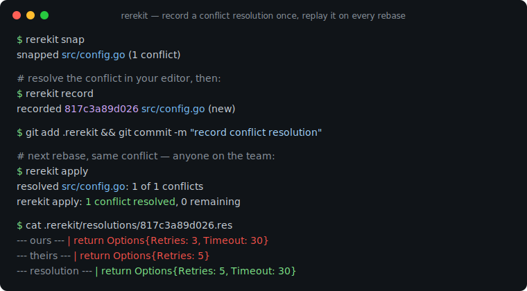
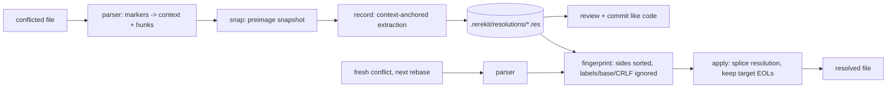

# rerekit

[English](README.md) | [中文](README.zh.md) | [日本語](README.ja.md)

[](LICENSE) [](go.mod) [](CHANGELOG.md)  [](CONTRIBUTING.md)

**rerekit：オープンソース・依存ゼロ・チーム全体のための rerere —— git のコンフリクト解決をコミット可能で人間が読めるテキストファイルとして記録し、コードのようにレビューし、リベースのたびに再生する。**



```bash
git clone https://github.com/JaydenCJ/rerekit && cd rerekit
go build -o rerekit ./cmd/rerekit    # single static binary, stdlib only
```

> プレリリース：v0.1.0 はまだどのパッケージレジストリにも公開されていません。上記の手順でソースからビルドしてください（Go ≥1.22 なら何でも可）。

## なぜ rerekit？

`git rerere` は git で最も知られていない優れた機能です：コンフリクトをどう解決したかを覚え、次回は自動で解決してくれます。しかしそのキャッシュはクローン単位で不透明 —— `.git/rr-cache` 配下の SHA 名のバイナリ blob は `git push` からは見えず、レビュー不可能で、しかも*ファイル*単位でハッシュされるため、コンフリクトが 1 つ動くだけでそのファイルの記録済み解決が全部無効になります。リベースや stacked-diff を多用するチームはこれを毎日実感しています：長寿命ブランチ間の同じコンフリクトを、全エンジニアが、全マシンで、restack のたびに解き直し —— しかも同僚が同じ解き方をしたかは誰にも見えません。rerekit は各解決を `.rerekit/resolutions/` 配下の小さなテキストファイルにします：コンフリクトの両側と解決本体を、ファイル 1 行につき `|` 接頭辞 1 行で。それをコミットすれば、レビュアーは他の変更と同じように diff で読め、`rerekit apply` が全員のために再生します —— hunk 単位でマッチし、リベースの向きが逆でも命中（フィンガープリントは ours/theirs 交換に対して対称）、merge と diff3 の両スタイル、CRLF と LF もまたぎます。コンフリクト両側にはチェックサムが付き、手で壊されたファイルは静かにマッチしなくなるのではなく大声で失敗します。

| | rerekit | git rerere | rr-cache の同期 | 毎回手で解き直す |
|---|---|---|---|---|
| 解決をチームで共有 | ✅ コミットされるファイル | ❌ クローン単位 | ⚠️ rsync/CI 配管 | ❌ |
| PR の diff でレビュー可能 | ✅ プレーンテキスト | ❌ バイナリ blob | ❌ バイナリ blob | ❌ |
| マッチの粒度 | ✅ hunk 単位 | ❌ ファイル preimage 単位 | ❌ ファイル preimage 単位 | — |
| ours/theirs の向きが逆でも命中 | ✅ | ✅ | ✅ | — |
| merge ↔ diff3、CRLF ↔ LF をまたぐ | ✅ 正規化 | ⚠️ スタイルが変わると外れる | ⚠️ スタイルが変わると外れる | — |
| 破損検出 | ✅ 両側にチェックサム | ❌ 静かに外れる | ❌ 静かに外れる | — |
| git の外でも使える（マーカー付きなら何でも） | ✅ | ❌ | ❌ | ✅ |
| ランタイム依存 | 0（静的バイナリ 1 個） | git 組み込み | git + 同期基盤 | あなたの忍耐 |

<sub>2026-07-13 確認：rerekit は Go 標準ライブラリのみを import。`.git/rr-cache` のエントリは SHA-1 名でラベルなしの preimage/postimage 対で、clone にも push にも含まれない。</sub>

## 機能

- **コミット可能で diff できる解決** —— コンフリクトごとに 1 つの `.res` テキストファイル：`key: value` ヘッダに `ours` / `theirs` / `resolution` の `|` 接頭辞セクション。バイト決定的でタイムスタンプなし —— コミットされたファイルは無駄に変化しません。
- **どの向きからでも再生** —— フィンガープリントはソート済みのコンフリクト両側だけを対象：ラベル、diff3 base、行末、周辺コンテキストはすべて除外。向きの反転、スタイル変更、Windows チェックアウト後も同じコンフリクトが命中します。
- **hunk 単位の粒度** —— rerere のファイル全体 preimage ハッシュと違い、各コンフリクトを個別に記録・照合。ファイル内の他の編集が解決を無効化することはありません。
- **儀式なしで記録** —— マーカーがあるうちに `snap`、いつも通りエディタで解決、終わったら `record`。抽出は hunk 間の手つかずのコンテキストをアンカーにし、コンテキストまで編集されていた場合は*拒否*します（推測はしません）。
- **レビュー安全性は構造から** —— resolution セクションはレビュー時に手で編集するためのもの。コンフリクト両側はロードのたびに完全性検証され、改変された同一性は静かに外れるのではなく大声で失敗します。
- **依存ゼロ・完全オフライン** —— Go 標準ライブラリのみ、静的バイナリ 1 個、ネットワーク呼び出しなし、テレメトリなし。git 風コンフリクトマーカーのあるファイルなら、git リポジトリの内外を問わず動きます。

## クイックスタート

リベースの途中、`src/config.go` にコンフリクトマーカーが残っている状態で：

```bash
rerekit snap                  # snapshot the conflict (auto-creates .rerekit/)
$EDITOR src/config.go         # resolve it the way you always do
rerekit record                # extract + save the resolution
git add .rerekit && git commit -m "record conflict resolution"
```

実際にキャプチャした出力：

```text
initialized empty store in .rerekit/
snapped src/config.go (1 conflict)
rerekit snap: 1 file snapped, 1 conflict pending
recorded 817c3a89d026 src/config.go (new)
rerekit record: 1 resolution recorded from 1 file
```

次の restack で同じコンフリクトが戻ってきます —— 両側は入れ替わり、ラベルも違う。チームの誰でも実行するだけ：

```text
$ rerekit apply
resolved src/config.go: 1 of 1 conflicts
rerekit apply: 1 conflict resolved, 0 remaining
```

そして記録されたファイルそのものがレビュー資料です（`rerekit show 817c3a89d026` の実出力）：

```text
rerekit-resolution-v1
fingerprint: 817c3a89d026c30103028aea14f4ffa61a00b503076fcf43e3c6e7bd8c445946
path: src/config.go
ours-label: HEAD
theirs-label: feature/retry

--- ours ---
|	return Options{Retries: 3, Timeout: 30}
--- theirs ---
|	return Options{Retries: 5}
--- resolution ---
|	return Options{Retries: 5, Timeout: 30}
--- end ---
```

## CLI リファレンス

`rerekit [init|snap|record|apply|status|list|show|forget|version]` —— パス省略時はストアルート配下のツリー全体（`.rerekit/` を探し、なければ git ルート）。終了コード：0 成功、1 apply 後も未解決コンフリクトあり、2 使い方エラー、3 実行時エラー。

| コマンド / フラグ | デフォルト | 効果 |
|---|---|---|
| `snap [paths]` | ツリー全体を走査 | マーカーがあるうちにコンフリクトファイルをスナップショット |
| `record` | スナップショットを消費 | スナップショットと解決済みファイルの差分から解決を抽出 |
| `record --keep-pending` | オフ | 記録後もスナップショットを保持 |
| `apply [paths]` | ツリー全体を走査 | 記録済みの解決を新しいコンフリクトに再生 |
| `apply --dry-run` | オフ | 書き込まずにマッチだけ報告 |
| `apply --snap` | オフ | 残ったコンフリクトを後の `record` 用にスナップショット |
| `status` / `list` `--format` | `text` | `text` か `json`（安定した `schema_version: 1` エンベロープ） |
| `show <id>` / `forget <id...>` | — | 解決の表示 / 削除。`forget --all` で全消去 |
| `init` | `snap` 時に自動 | `.rerekit/` を明示的に作成（git の外で必要） |

ファイル形式・フィンガープリント正規化規則・ストアレイアウトの仕様は [docs/format.md](docs/format.md)。`examples/` に実行可能なデモと CI 再生スクリプトがあります。

## 検証

このリポジトリは CI を一切同梱しません。上記の主張はすべてローカル実行で検証されます：

```bash
go test ./...            # 90 deterministic tests, offline, < 5 s
bash scripts/smoke.sh    # real git merges both directions, prints SMOKE OK
```

## アーキテクチャ



## ロードマップ

- [x] v0.1.0 —— マーカーパーサ（merge/diff3/CRLF）、対称 hunk フィンガープリント、完全性検証付きのコミット可能な `.res` 形式、snap/record/apply/status/list/show/forget、JSON 出力、90 テスト + smoke スクリプト
- [ ] `rerekit import-rerere` —— 既存の `.git/rr-cache` をテキスト解決に変換
- [ ] ファジーなコンテキストアンカー（近傍コンテキストが軽く編集されても記録可能に）
- [ ] `apply --check` モード：リベース前にスタック全体をドライ監査
- [ ] コンフリクトマーカー長の設定対応（`conflict-marker-size` 属性）
- [ ] ストア保守：もう発生し得ないコンフリクトの `gc`

全リストは [open issues](https://github.com/JaydenCJ/rerekit/issues) を参照してください。

## コントリビュート

Issue・議論・PR を歓迎します —— ローカルワークフロー（format、vet、テスト、`SMOKE OK`）は [CONTRIBUTING.md](CONTRIBUTING.md) へ。入門タスクは [good first issue](https://github.com/JaydenCJ/rerekit/issues?q=is%3Aissue+is%3Aopen+label%3A%22good+first+issue%22)、設計の話題は [Discussions](https://github.com/JaydenCJ/rerekit/discussions) で。

## ライセンス

[MIT](LICENSE)
