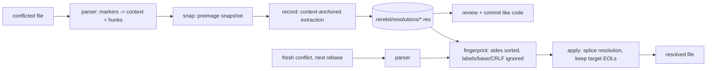

# rerekit

[English](README.md) | [中文](README.zh.md) | [日本語](README.ja.md)

[](LICENSE) [](go.mod) [](CHANGELOG.md)  [](CONTRIBUTING.md)

**rerekit：an open-source, zero-dependency rerere for the whole team — git conflict resolutions recorded as committable, human-readable text files, reviewed like code and replayed on every rebase.**


```bash
git clone https://github.com/JaydenCJ/rerekit && cd rerekit
go build -o rerekit ./cmd/rerekit    # single static binary, stdlib only
```

> Pre-release: v0.1.0 is not tagged on a package registry yet; build from source as above (any Go ≥1.22).

## Why rerekit?

`git rerere` is git's best unknown feature: it remembers how you resolved a conflict and resolves it for you the next time. But its cache is per-clone and opaque — SHA-named binary blobs under `.git/rr-cache`, invisible to `git push`, impossible to review, and hashed per *file*, so moving one conflict invalidates every recorded resolution in that file. Teams doing heavy rebase and stacked-diff workflows feel this daily: the same conflict between two long-lived branches gets re-resolved by every engineer, on every machine, on every restack — and nobody can see whether their colleague resolved it the same way. rerekit turns each resolution into a small text file under `.rerekit/resolutions/`: the two conflicting sides, the resolution, one `|`-prefixed payload line per file line. You commit it, a reviewer reads it in the diff like any other change, and `rerekit apply` replays it for everyone — matching per hunk, from either rebase direction (fingerprints are symmetric under ours/theirs swap), from merge or diff3 checkouts, across CRLF and LF. The conflict sides are checksummed, so a hand-mangled file fails loudly instead of silently never matching again.

| | rerekit | git rerere | syncing rr-cache | re-resolving by hand |
|---|---|---|---|---|
| Resolutions shared with the team | ✅ committed files | ❌ per-clone | ⚠️ rsync/CI plumbing | ❌ |
| Reviewable in a PR diff | ✅ plain text | ❌ binary blobs | ❌ binary blobs | ❌ |
| Match granularity | ✅ per hunk | ❌ per file preimage | ❌ per file preimage | — |
| Matches when ours/theirs swap direction | ✅ | ✅ | ✅ | — |
| Matches across merge ↔ diff3, CRLF ↔ LF | ✅ normalized | ⚠️ style changes miss | ⚠️ style changes miss | — |
| Corruption detection | ✅ checksummed sides | ❌ silent misses | ❌ silent misses | — |
| Works outside git (any marker-conflicted file) | ✅ | ❌ | ❌ | ✅ |
| Runtime dependencies | 0 (one static binary) | git built-in | git + sync infra | your patience |

<sub>Checked 2026-07-13: rerekit imports the Go standard library only; `.git/rr-cache` entries are unlabelled preimage/postimage pairs named by SHA-1, excluded from clone and push.</sub>

## Features

- **Committable, diffable resolutions** — each conflict becomes one `.res` text file: `key: value` headers plus `ours` / `theirs` / `resolution` sections with `|`-prefixed lines. Deterministic bytes, no timestamps — committed files never churn.
- **Replay from any direction** — fingerprints cover only the two conflicting sides, sorted: labels, diff3 base, line endings, and surrounding context are all excluded, so the same conflict matches after a direction flip, a style change, or a Windows checkout.
- **Hunk-level granularity** — unlike rerere's whole-file preimage hash, each conflict is recorded and matched individually; other edits to the file never invalidate a resolution.
- **Record without ceremony** — `snap` while the markers are in place, resolve in your editor as usual, `record` when done. Extraction anchors on the untouched context between hunks and *refuses* (never guesses) if that context was edited too.
- **Reviewer-safe by construction** — the resolution section is meant to be edited in review; the conflict sides are integrity-checked on every load, so a tampered identity fails loudly instead of silently never matching.
- **Zero dependencies, fully offline** — Go standard library only, one static binary, no network calls, no telemetry; works on any file with git-style conflict markers, git repo or not.

## Quickstart

Mid-rebase, with conflict markers sitting in `src/config.go`:

```bash
rerekit snap                  # snapshot the conflict (auto-creates .rerekit/)
$EDITOR src/config.go         # resolve it the way you always do
rerekit record                # extract + save the resolution
git add .rerekit && git commit -m "record conflict resolution"
```

Real captured output:

```text
initialized empty store in .rerekit/
snapped src/config.go (1 conflict)
rerekit snap: 1 file snapped, 1 conflict pending
recorded 817c3a89d026 src/config.go (new)
rerekit record: 1 resolution recorded from 1 file
```

Next restack, the same conflict comes back — sides swapped, labels different. Anyone on the team runs:

```text
$ rerekit apply
resolved src/config.go: 1 of 1 conflicts
rerekit apply: 1 conflict resolved, 0 remaining
```

And the recorded file itself is the review artifact (real output of `rerekit show 817c3a89d026`):

```text
rerekit-resolution-v1
fingerprint: 817c3a89d026c30103028aea14f4ffa61a00b503076fcf43e3c6e7bd8c445946
path: src/config.go
ours-label: HEAD
theirs-label: feature/retry

--- ours ---
|	return Options{Retries: 3, Timeout: 30}
--- theirs ---
|	return Options{Retries: 5}
--- resolution ---
|	return Options{Retries: 5, Timeout: 30}
--- end ---
```

## CLI reference

`rerekit [init|snap|record|apply|status|list|show|forget|version]` — paths default to the whole tree under the store root (found via `.rerekit/`, then the git root). Exit codes: 0 ok, 1 apply left conflicts unresolved, 2 usage error, 3 runtime error.

| Command / flag | Default | Effect |
|---|---|---|
| `snap [paths]` | scan whole tree | snapshot conflicted files while markers are in place |
| `record` | consumes snapshots | extract resolutions by diffing snapshot vs. resolved file |
| `record --keep-pending` | off | keep snapshots after recording |
| `apply [paths]` | scan whole tree | replay recorded resolutions onto fresh conflicts |
| `apply --dry-run` | off | report matches without writing |
| `apply --snap` | off | snapshot leftover conflicts for a later `record` |
| `status` / `list` `--format` | `text` | `text` or `json` (stable `schema_version: 1` envelope) |
| `show <id>` / `forget <id...>` | — | print / remove one resolution; `forget --all` clears |
| `init` | auto on `snap` | create `.rerekit/` explicitly (needed outside git) |

File formats, fingerprint normalization rules, and the store layout are specified in [docs/format.md](docs/format.md); `examples/` has runnable demo and CI-replay scripts.

## Verification

This repository ships no CI; every claim above is verified by local runs:

```bash
go test ./...            # 90 deterministic tests, offline, < 5 s
bash scripts/smoke.sh    # real git merges both directions, prints SMOKE OK
```

## Architecture



## Roadmap

- [x] v0.1.0 — marker parser (merge/diff3/CRLF), symmetric hunk fingerprints, committable `.res` format with integrity check, snap/record/apply/status/list/show/forget, JSON output, 90 tests + smoke script
- [ ] `rerekit import-rerere` — convert an existing `.git/rr-cache` into text resolutions
- [ ] Fuzzy context anchoring (record even when nearby context was lightly edited)
- [ ] `apply --check` mode for pre-rebase dry audits across a whole stack
- [ ] Configurable conflict-marker size (`conflict-marker-size` attribute)
- [ ] Store maintenance: `gc` for resolutions whose conflicts can no longer occur

See the [open issues](https://github.com/JaydenCJ/rerekit/issues) for the full list.

## Contributing

Issues, discussions and pull requests are welcome — see [CONTRIBUTING.md](CONTRIBUTING.md) for the local workflow (format, vet, tests, `SMOKE OK`). Good entry points are labelled [good first issue](https://github.com/JaydenCJ/rerekit/issues?q=is%3Aissue+is%3Aopen+label%3A%22good+first+issue%22), and design questions live in [Discussions](https://github.com/JaydenCJ/rerekit/discussions).

## License

[MIT](LICENSE)
