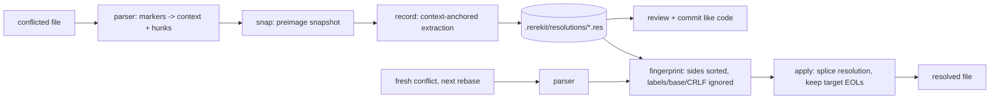

# rerekit

[English](README.md) | [中文](README.zh.md) | [日本語](README.ja.md)

[](LICENSE) [](go.mod) [](CHANGELOG.md)  [](CONTRIBUTING.md)

**rerekit：开源、零依赖、属于整个团队的 rerere —— 把 git 冲突解法记录成可提交、人类可读的文本文件，像代码一样评审，在每次 rebase 时自动重放。**


```bash
git clone https://github.com/JaydenCJ/rerekit && cd rerekit
go build -o rerekit ./cmd/rerekit    # single static binary, stdlib only
```

> 预发布：v0.1.0 尚未发布到任何包注册表；请按上述方式从源码构建（任意 Go ≥1.22）。

## 为什么选 rerekit？

`git rerere` 是 git 最好却最少人知道的功能：它记住你如何解决某个冲突，下次自动替你解决。但它的缓存是单克隆、不透明的 —— `.git/rr-cache` 下按 SHA 命名的二进制 blob，`git push` 看不见，无法评审，而且以整个*文件*为单位做哈希，挪动一个冲突就会作废该文件里所有已记录的解法。重度 rebase 和 stacked-diff 工作流的团队每天都在体会这一点：两条长期分支之间同一个冲突，被每位工程师、在每台机器上、每次 restack 时重新解一遍 —— 而且没人能看到同事是不是解得一样。rerekit 把每个解法变成 `.rerekit/resolutions/` 下的一个小文本文件：冲突的两侧、解法本身，每行文件内容对应一行 `|` 前缀载荷。你提交它，评审者像看任何改动一样在 diff 里读它，然后 `rerekit apply` 为所有人重放 —— 按 hunk 匹配，rebase 换方向也能命中（指纹对 ours/theirs 交换对称），merge 与 diff3 风格通吃，CRLF 与 LF 互认。冲突两侧带校验和，被手改坏的文件会大声报错，而不是从此悄悄再也匹配不上。

| | rerekit | git rerere | 同步 rr-cache | 每次手工重解 |
|---|---|---|---|---|
| 解法与团队共享 | ✅ 提交的文件 | ❌ 单克隆 | ⚠️ rsync/CI 管道 | ❌ |
| 可在 PR diff 里评审 | ✅ 纯文本 | ❌ 二进制 blob | ❌ 二进制 blob | ❌ |
| 匹配粒度 | ✅ 按 hunk | ❌ 按文件 preimage | ❌ 按文件 preimage | — |
| ours/theirs 方向互换仍命中 | ✅ | ✅ | ✅ | — |
| merge ↔ diff3、CRLF ↔ LF 互认 | ✅ 归一化 | ⚠️ 风格一变就丢 | ⚠️ 风格一变就丢 | — |
| 损坏检测 | ✅ 两侧带校验和 | ❌ 静默失配 | ❌ 静默失配 | — |
| git 之外也能用（任何带标记的冲突文件） | ✅ | ❌ | ❌ | ✅ |
| 运行时依赖 | 0（单个静态二进制） | git 内置 | git + 同步设施 | 你的耐心 |

<sub>核查于 2026-07-13：rerekit 仅导入 Go 标准库；`.git/rr-cache` 条目是按 SHA-1 命名、无标注的 preimage/postimage 对，clone 和 push 都不带它。</sub>

## 功能

- **可提交、可 diff 的解法** —— 每个冲突生成一个 `.res` 文本文件：`key: value` 头部加 `ours` / `theirs` / `resolution` 三段 `|` 前缀内容。字节确定、无时间戳 —— 提交的文件永不无谓变动。
- **任意方向重放** —— 指纹只覆盖排序后的冲突两侧：标签、diff3 base、行尾、周围上下文全部排除，所以方向翻转、风格切换或 Windows 检出后同一冲突照样命中。
- **hunk 级粒度** —— 不同于 rerere 的整文件 preimage 哈希，每个冲突独立记录、独立匹配；文件里的其他改动永远不会作废某条解法。
- **记录零仪式感** —— 标记还在时 `snap`，照常在编辑器里解冲突，解完 `record`。提取以 hunk 之间未动过的上下文为锚点，上下文也被改过时会*拒绝*（绝不瞎猜）。
- **评审安全是构造出来的** —— resolution 段就是为评审时手改设计的；冲突两侧每次加载都做完整性校验，身份被篡改会大声失败，而不是悄悄永不匹配。
- **零依赖、完全离线** —— 仅 Go 标准库，单个静态二进制，无网络调用，无遥测；任何带 git 风格冲突标记的文件都能处理，在不在 git 仓库里都行。

## 快速上手

rebase 进行到一半，`src/config.go` 里躺着冲突标记：

```bash
rerekit snap                  # snapshot the conflict (auto-creates .rerekit/)
$EDITOR src/config.go         # resolve it the way you always do
rerekit record                # extract + save the resolution
git add .rerekit && git commit -m "record conflict resolution"
```

真实捕获的输出：

```text
initialized empty store in .rerekit/
snapped src/config.go (1 conflict)
rerekit snap: 1 file snapped, 1 conflict pending
recorded 817c3a89d026 src/config.go (new)
rerekit record: 1 resolution recorded from 1 file
```

下次 restack，同一个冲突回来了 —— 两侧互换、标签不同。团队里任何人运行：

```text
$ rerekit apply
resolved src/config.go: 1 of 1 conflicts
rerekit apply: 1 conflict resolved, 0 remaining
```

而记录下来的文件本身就是评审材料（`rerekit show 817c3a89d026` 的真实输出）：

```text
rerekit-resolution-v1
fingerprint: 817c3a89d026c30103028aea14f4ffa61a00b503076fcf43e3c6e7bd8c445946
path: src/config.go
ours-label: HEAD
theirs-label: feature/retry

--- ours ---
|	return Options{Retries: 3, Timeout: 30}
--- theirs ---
|	return Options{Retries: 5}
--- resolution ---
|	return Options{Retries: 5, Timeout: 30}
--- end ---
```

## CLI 参考

`rerekit [init|snap|record|apply|status|list|show|forget|version]` —— 路径默认是存储根目录下整棵树（先找 `.rerekit/`，再退到 git 根）。退出码：0 成功，1 apply 后仍有未解冲突，2 用法错误，3 运行时错误。

| 命令 / 标志 | 默认 | 作用 |
|---|---|---|
| `snap [paths]` | 扫描整棵树 | 在标记还在时为冲突文件做快照 |
| `record` | 消费快照 | 用快照与已解文件对比，提取解法 |
| `record --keep-pending` | 关 | 记录后保留快照 |
| `apply [paths]` | 扫描整棵树 | 把已记录的解法重放到新出现的冲突上 |
| `apply --dry-run` | 关 | 只报告匹配，不写文件 |
| `apply --snap` | 关 | 把剩余冲突快照下来，供之后 `record` |
| `status` / `list` `--format` | `text` | `text` 或 `json`（稳定的 `schema_version: 1` 信封） |
| `show <id>` / `forget <id...>` | — | 打印 / 删除某条解法；`forget --all` 清空 |
| `init` | `snap` 时自动 | 显式创建 `.rerekit/`（git 之外需要） |

文件格式、指纹归一化规则与存储布局的规范见 [docs/format.md](docs/format.md)；`examples/` 里有可运行的演示与 CI 重放脚本。

## 验证

本仓库不带任何 CI；上面的每一条声明都由本地运行验证：

```bash
go test ./...            # 90 deterministic tests, offline, < 5 s
bash scripts/smoke.sh    # real git merges both directions, prints SMOKE OK
```

## 架构



## 路线图

- [x] v0.1.0 —— 标记解析器（merge/diff3/CRLF）、对称 hunk 指纹、带完整性校验的可提交 `.res` 格式、snap/record/apply/status/list/show/forget、JSON 输出、90 个测试 + smoke 脚本
- [ ] `rerekit import-rerere` —— 把已有的 `.git/rr-cache` 转换成文本解法
- [ ] 模糊上下文锚定（附近上下文被轻微改动时也能记录）
- [ ] `apply --check` 模式，在 rebase 前对整个 stack 做干跑审计
- [ ] 可配置的冲突标记长度（`conflict-marker-size` 属性）
- [ ] 存储维护：为不可能再出现的冲突提供 `gc`

完整列表见 [open issues](https://github.com/JaydenCJ/rerekit/issues)。

## 参与贡献

欢迎 issue、讨论与 PR —— 本地工作流（format、vet、测试、`SMOKE OK`）见 [CONTRIBUTING.md](CONTRIBUTING.md)。入门任务标注为 [good first issue](https://github.com/JaydenCJ/rerekit/issues?q=is%3Aissue+is%3Aopen+label%3A%22good+first+issue%22)，设计讨论在 [Discussions](https://github.com/JaydenCJ/rerekit/discussions)。

## 许可证

[MIT](LICENSE)
